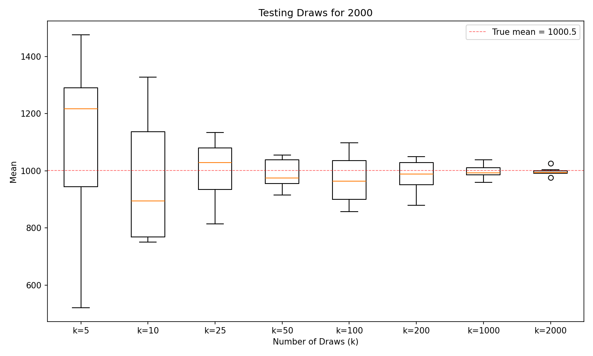

# Law of Large Numbers — Snakemake Pipeline

Demonstrates the Law of Large Numbers by sampling from the range **1 to n** repeatedly and showing that as the number of draws increases, the sample mean converges to the true mean `(n+1)/2`.

## Requirements

- Python 3.8+
- snakemake
- matplotlib

## Running the pipeline

```bash
snakemake --cores 4
```

## Output

`results/law_of_large_numbers_n{n}.png` — box plots of sample means for each k value.

## Results



## Configuration (`config.yaml`)

| Parameter   | Default | Description |
|-------------|---------|-------------|
| `n`         | 2000    | Upper bound of the sampling range (1 to n) |
| `k_values`  | [5, 10, 25, 50, 100, 200, 1000, 2000] | Number of draws per experiment |
| `n_repeats` | 10      | Number of experiments per k (controls box plot resolution) |

### Add a new k value (e.g. k=5000)

Edit `config.yaml`:
```yaml
k_values: [5, 10, 25, 50, 100, 200, 1000, 2000, 5000]
```

### Change n (e.g. test range 1 to 1000)

Edit `config.yaml`:
```yaml
n: 1000
```

Then re-run `snakemake --cores 4`.
